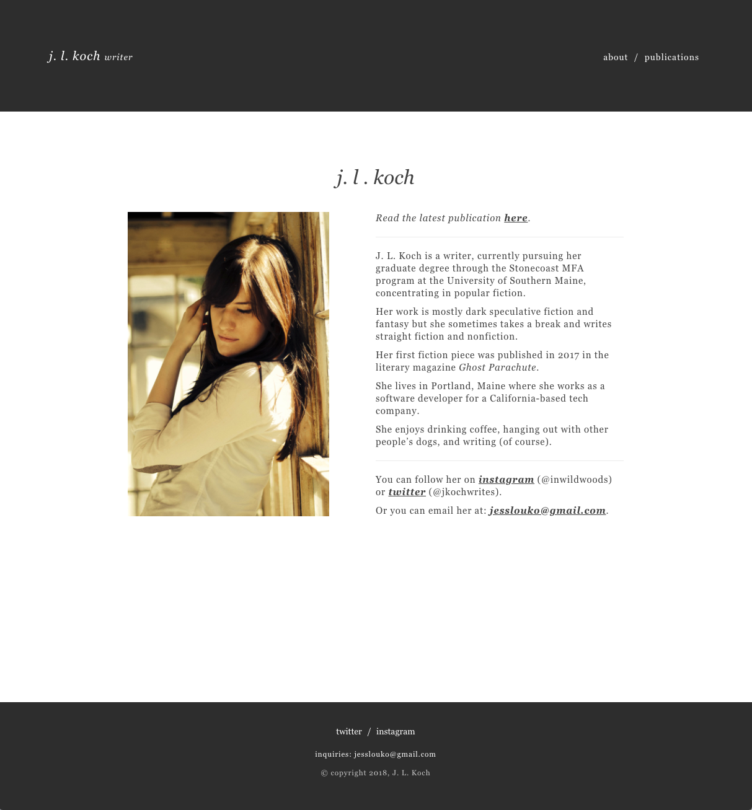

# Personal Writing/Author Site

[Live Site](http://www.jesskoch.com/)

A (very) minimal personal website that I use to share publications for my graduate program. It includes a blog but it's not currently turned on because I don't have any posts yet! It's also fully responsive. 

## Development

Django, Python, HTML, CSS.

## Future Considerations

* Turn on blog
* Custom CMS

## Preview

